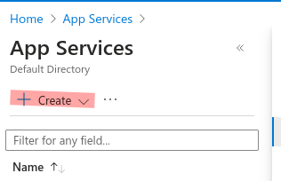
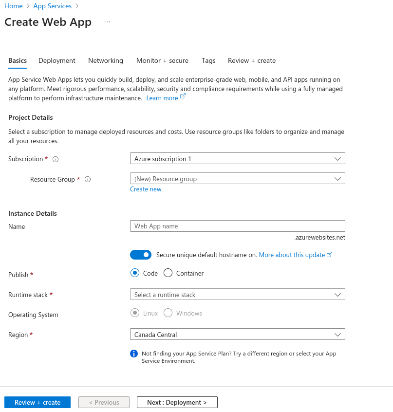
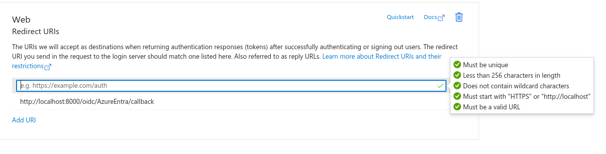
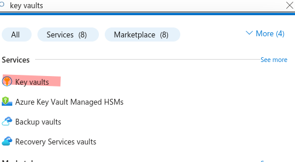
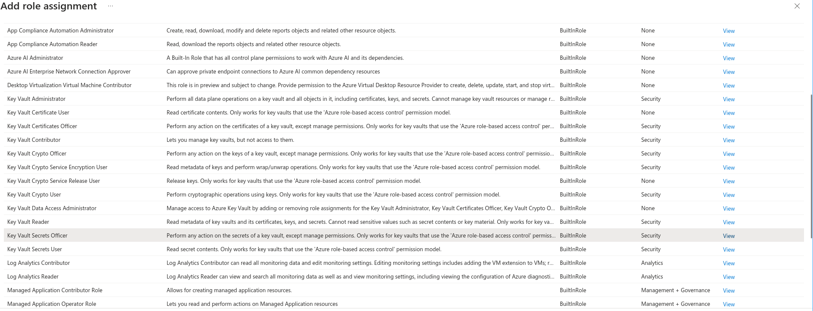

# dash-with-auth

## **Running the Application**

### **Install Dependencies**

To install the required dependencies, run:

```bash
pip install -r requirements.txt
```

This command installs essential packages such as `gunicorn`, `dash`, and others.


### **Set Required Environment Variables**

Before running the application, configure the following environment variables:

| **Variable**                     | **Description**                                      | **Notes**                          |
|-----------------------------------|-----------------------------------------------------|-------------------------------------|
| `DASH_WITH_AUTH_DEBUG`            | Specific to development server. Enable or disable debug mode.| Set to `False` in production.      |
| `DASH_WITH_AUTH_PORT`             | Specific to development server only. Refer to note `of DASH_WITH_AUTH_HOST` otherwise. Port to use for the application.|                                     |
| `DASH_WITH_AUTH_SECRET`           | Flask secret key for session management.            |                                     |
| `DASH_WITH_AUTH_OIDC_ID`          | OIDC (OpenID Connect) App ID.                       |                                     |
| `DASH_WITH_AUTH_OIDC_SECRET`      | OIDC App Secret.                                    |                                     |
| `DASH_WITH_AUTH_OIDC_METADATA_URL`| URL for OIDC Metadata.                              |                                     |
| `DASH_WITH_AUTH_HOST`| Specific to development server only. Use `GUNICORN_CMD_ARGS` otherwise|Refer to https://docs.gunicorn.org/en/latest/settings.html#settings|
| `DASH_WITH_AUTH_OIDC_FORCE_HTTPS`|Whether to force HTTPS redirection. Should be set to True if SSL termination is handled upstream.|                                     |


### **Run the Application**

Start the application using the `gunicorn` server:

```bash
GUNICORN_CMD_ARGS="--bind=$DASH_WITH_AUTH_HOST:$DASH_WITH_AUTH_PORT" gunicorn app:server 
```

This launches the Dash application using the server configuration defined in `app.py`.


## **Deployment**

### **Azure Prerequisites**

For deployment, we assume the following Azure-based setup:

1. **Hosting and Authentication**:
   - OIDC provider: [Azure Entra ID](https://www.microsoft.com/en-us/security/business/identity-access/microsoft-entra-id)
   - Hosting platform: **Azure App Service**
   - CI/CD workflow: **Azure Pipeline**
   - Azure KeyVault for secrets storing

2. **Azure App Service**:
   - Create a Web App in the Azure portal.
   - Refer to the screenshots for guidance:
     - 
     - 

   **Important**: Keep the **web app name** handy, as it will be needed in the Azure Pipeline configuration.


### **Configure Azure Pipeline**

Set the following variables in your Azure Pipeline:

| **Variable**                | **Description**                                       |
|------------------------------|-------------------------------------------------------|
| `vmImageName`                | Name of the vm to use in the different pipeline steps|
| `webAppName`                | Name of the application in Azure App Service.        |
| `environmentName`           | Name of the deployment environment.                  |
| `azureServiceConnectionId`  | Azure service connection ID. Refer to [Azure Pipeline Documentation](https://learn.microsoft.com/en-us/azure/devops/pipelines/library/service-endpoints?view=azure-devops)                        |

### **Azure Pipeline Configuration**

Refer to [azure-pipelines.yml](azure-pipelines.yml) for an example

In summary there are two stages:

- **Build Stage**: Archives the application source code.
- **Deploy Stage**: Deploys the application to Azure App Service, setting all required environment variables.

## **App Registration in Azure Entra ID**

Follow these steps to create an app registration in Azure Entra ID:

1. **Access Entra ID**:
   - In the Azure portal, search for **Entra ID**.

2. **Create Application**:
   - Navigate to `+ Add > App Registration`.
   - Set a redirect URL. Example:
     - 
     - Include `localhost` if local testing is required.
     - Add the web app domain with the route `/oidc/AzureEntra/callback` (replace `AzureEntra` with the IDP name in `app.py`).

3. **Configure Variables**:
   - **Application ID**: `DASH_WITH_AUTH_OIDC_ID` should point to this value. Refer to next section for how.
   - **Tenant ID**: Use this to configure the `DASH_WITH_AUTH_OIDC_METADATA_URL` environment variable.
   - **Client Secret**: Generate a secret under *Certificates & Secrets*. `DASH_WITH_AUTH_OIDC_SECRET` should point to this value. Refer to next section for how.


## Web Application Environment Variables


### Setting Environment Variables in Azure Portal

To configure your web app on Azure Portal, define the following environment variables under the **Environment Variables** section of your app's settings:

| **Variable**                        | **Description**                                                                                       |
|-------------------------------------|-------------------------------------------------------------------------------------------------------|
| `DASH_WITH_AUTH_SECRET`             | Flask secret key for session management.                                                             |
| `DASH_WITH_AUTH_OIDC_ID`            | OIDC App ID. Refer to the **App Registration** section for details.                                  |
| `DASH_WITH_AUTH_OIDC_SECRET`        | OIDC App Secret. Refer to the **App Registration** section for details.                              |
| `DASH_WITH_AUTH_OIDC_METADATA_URL`  | URL for OIDC metadata. Use the format: `https://login.microsoftonline.com/{tenant_id}/v2.0/.well-known/openid-configuration`. |
| `DASH_WITH_AUTH_OIDC_FORCE_HTTPS`|Whether to force HTTPS redirection. Should be to 1 here                                                  |

### Handling Sensitive Variables Securely

For sensitive variables like `DASH_WITH_AUTH_SECRET` and `DASH_WITH_AUTH_OIDC_SECRET`, **do not hardcode their values** directly in the environment variables. Instead, retrieve these secrets securely from Azure Key Vault by using the following format in the **value field**:

```plaintext
@Microsoft.KeyVault(SecretUri=<url-to-secret>)
```

Replace `<url-to-secret>` with the URL of the specific secret stored in Azure Key Vault. This is explained more [here](https://learn.microsoft.com/en-us/azure/app-service/app-service-key-vault-references?tabs=azure-cli#source-app-settings-from-key-vault)

### Azure Key Vault 

#### 1. Create a Key Vault

1. In the Azure Portal, search for **Key Vault** using the search bar and click on **+ Create** to set up a new Key Vault.  
   

2. Fill out the required fields. For this guide, we assume you have selected the recommended permission model: **Azure role-based access control (Azure RBAC)**.

#### 2. Configure Permissions

You need to set up two permissions for the Key Vault:  
- **Permission 1:** For a user to create and manage secrets.  
- **Permission 2:** For the application to read secrets.  


##### Permission 1: Grant Secret Creation Access (User/Administrator)

1. Navigate to your Key Vault's **Access Control (IAM)** page.  
2. Click **+ Add** to create a role assignment.  
3. In the **Role** dropdown, select **Key Vault Secrets Officer**.  
   
4. Under **Assign access to**, select **User, group, or service principal**.  
5. Add the desired user or group as a member with **read and write access** to the secrets.  
6. Click **Next** and complete the role assignment.


##### Permission 2: Grant Read-Only Access to the Application

1. Return to the Key Vault's **Access Control (IAM)** page.  
2. Click **+ Add** to create another role assignment.  
3. In the **Role** dropdown, select **Key Vault Secrets User**.  
4. Under the **Members** tab, choose **Managed identity** as the access type.  
5. Select **App Service** as the managed identity resource type.  
6. Choose the application associated with your App Service.  
7. Finalize the role assignment.  


#### 3. Retrieve the Secret URI

To use secrets in your app:

1. Go to the Key Vault's **Secrets** section.  
2. Click on the specific secret you want to use.  
3. Copy the **Secret Identifier (SecretUri)**, which you will use in your app’s environment variables.  

Example usage in environment variables:  

```plaintext
@Microsoft.KeyVault(SecretUri=<SecretUri>)
```

This allows your application to securely access secrets stored in Azure Key Vault.

### Warning Note

Do not setup web app environment variables in the pipeline, only in the web app portal page. This practice is unsecure as it gets copied to the configuration page of the web app configuration page on Azure portal, even variables declared as secret will appear as text. 

Those environment variables should be set on web app side.
